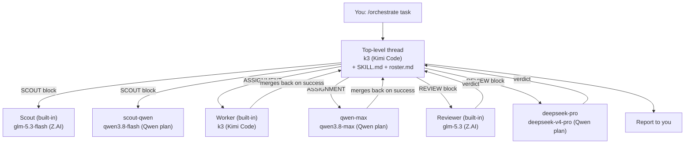

# zetta-delta: multi-model orchestration for Delta

Run one Delta thread as an orchestrator that hands work to subagents on
different providers, keeps each provider within its limits, has every change
reviewed by a different model family, and spends per-token money only when
you allow it.

The installer adds:

- One custom subagent profile per model, pinned to its model and thinking
  level; the task block sets its role (worker, reviewer, or best-of-N
  candidate). The orchestrator passes no model unless you name one, and the
  install fits Delta's limit of 7 custom profiles (section 3).
- The `/orchestrate` skill, with a roster of models, lanes, budgets, and
  reviewer order generated for your accounts.
- `/adversarial` and `/isolated`: two more ways to run a thread, for any
  task (section 8).
- The context router and Ponytail rules, written into Delta's Personal
  AGENTS.md (section 6).

`stack/install.sh` builds and installs the context tools those rules route to
(section 9), and `examples/agents-prepare.sh` gives each checkout its own
ports and test names (section 5).

## How it works

There is no orchestrator profile, because in Delta the orchestrator is not
a subagent. It is the top-level thread you are typing into.

Three pieces cooperate:

| Piece | What it is | Where it lives |
|---|---|---|
| **The thread** | The orchestrator. Its agent owns your conversation and Delta's subagent tool. | A normal Delta thread, model chosen before the first message |
| **The skill** | The orchestrator's job description: procedure, invariants, task blocks, budgets | `~/.agents/skills/orchestrate/` |
| **The profiles** | The roles it can delegate to, each pinned to a model | Built-in Scout/Worker/Reviewer, plus `<delta config>/profiles/*.toml` |

What happens when you type `/orchestrate <task>`:

1. Delta attaches `SKILL.md` to your message. The skill is marked
   `disable-model-invocation: true`, so it only ever loads when you invoke it.
2. The thread's own agent (for example `k3`) reads it, then reads
   `references/roster.md`: the models, lanes, budgets, and reviewer order the
   installer generated for your accounts.
3. It plans, then calls Delta's subagent tool once per unit of work, naming a
   profile (`worker`, `qwen-max`, `reviewer`, ...) and sending a filled-in
   task block that carries the rules.
4. Delta runs each subagent in its own conversation and worktree, on the
   profile's model, and returns its final report to the thread.
5. The thread reviews, integrates, and reports back to you.



Delta's built-in Scout, Worker, and Reviewer keep Delta's own tuning; you pin
their models in Settings (section 4). The rules travel in the task blocks the
skill sends, so built-in and custom profiles follow the same ones: router-first
search, `rtk` for shell output, terse reports, a simplicity check in reviews,
and never reverting, discarding, stashing, or deleting uncommitted work that
was there before the task unless told to. Custom profiles add more scout
families, more model families on other lanes, and the local lane. Each custom
model's profile works, reviews, or competes in best-of-N as its task block
says; the built-in Worker and Reviewer serve as best-of-N candidates the same
way.

## Contents

| Path | Installed to | Installed when |
|---|---|---|
| `profiles/scout-qwen.toml.tmpl` | `<delta config>/profiles/` | Always |
| `profiles/scout-deepseek.toml.tmpl` | same | Always |
| `profiles/model.toml.tmpl` | same, as `<name>.toml`, one per model | `qwen-max`, `deepseek-pro` always; `minimax` when `MINIMAX_PROVIDER` is set; `gpt-sol` and `gpt-astra` when `GPT_PROVIDER` is set; `grok` when `GROK_PROVIDER` is set |
| `profiles/scout-gemini.toml.tmpl` | same | `COPILOT_PROVIDER` set |
| `profiles/scout-local.toml.tmpl` | same | `LOCAL_PROVIDER` and `LOCAL_MODEL` set |
| `skills/orchestrate/SKILL.md` | `~/.agents/skills/orchestrate/` | Always |
| `skills/orchestrate/references/best-of-n.md` | same `references/` | Always |
| `skills/orchestrate/scripts/bon.sh` | same `scripts/`, and `~/.agents/skills/isolated/scripts/` | Always; best-of-N snapshot, patch handoff, apply, cleanup |
| `skills/adversarial/SKILL.md` | `~/.agents/skills/adversarial/` | Always |
| `skills/isolated/SKILL.md` | `~/.agents/skills/isolated/` | Always |
| `tests/bon-test.sh` | Not installed | Regression check for `bon.sh`: `sh tests/bon-test.sh` |
| `tests/install-test.sh` | Not installed | Regression check for the installer's curl mode, refusals, backups, the Personal AGENTS.md update, and `--clean`: `sh tests/install-test.sh` |
| `tests/prepare-test.sh` | Not installed | Regression check for `examples/agents-prepare.sh`: `sh tests/prepare-test.sh` |
| `references/roster.md` | each skill's `references/` | Generated by the installer, the same copy in each skill |
| `rules/personal-AGENTS.md` | Not installed | Source of the router block in Personal AGENTS.md |
| Router and Ponytail blocks | `~/.config/delta/AGENTS.md` (Settings > Rules > Personal AGENTS.md) | Generated on every run; replaces only those two blocks and keeps the rest of the file |
| `examples/agents-prepare.sh` | your project's `.agents/prepare` | By hand, per project |
| `stack/install.sh` | Not installed | Run by hand; builds and installs the context tools (section 9) |
| `stack/patches/<tool>/` | Not installed | Applied in order to each tool's pinned upstream release |
| `stack/context-indexes/ensure-context-indexes.py` | `~/.local/share/zetta-delta/` | By `stack/install.sh`; tests: `python3 -m unittest` in that folder |
| `stack/zvec-grep/verify-install.py` | `~/.local/share/zvec-grep/` | By `stack/install.sh`, pinned to the zvec-grep it installs; tests: `python3 -m unittest` in that folder |
| `deploy.env.example` | Not installed | Template for `deploy.env` (ignored by git), sourced before `install.sh` to repeat an install |
| `install.sh` | Not installed | Run by hand (section 3) |

The Delta config directory is the folder containing `settings.json`:
`~/Library/Application Support/delta` on macOS.

## 1. Prerequisites

Each provider entry already works in Delta, with `interleaved_reasoning` on for
every model and the output limits configured. For the Z.AI Coding Plan, use
the OpenAI-compatible base URL `https://api.z.ai/api/coding/paas/v4` and confirm
Delta is on Z.AI's supported-tools list; the plan is limited to those tools.

## 2. Find your provider ids

Profiles reference models as `<provider-id>/<model-id>`. A custom provider's
id is `custom:` followed by the SHA-256 of its base URL exactly as stored in
`settings.json`. Print every custom provider's id with:

```bash
python3 - <<'EOF'
import hashlib, json, os
d = json.load(open(os.path.expanduser("~/Library/Application Support/delta/settings.json")))
for p in d["native"]["custom_providers"]:
    print(f'{p["name"]:24} custom:{hashlib.sha256(p["base_url"].encode()).hexdigest()}')
EOF
```

Changing a provider's base URL changes its id; rerun the installer with
`--force` afterwards.

Delta's built-in subscription providers have fixed ids: `openai-subscribed`
(ChatGPT) and `x_ai-subscribed` (Grok).

## 3. Install

### With curl

Pin a commit: the URL fetches that commit's `install.sh`, and
`ZETTA_DELTA_REF` makes it fetch the same commit's files. The installer
refuses to fetch without it rather than take whatever `main` holds. The
latest commit is the first field of
`git ls-remote https://github.com/beardedeagle/zetta-delta main`.

```bash
ref=<commit>
curl -fsSL "https://raw.githubusercontent.com/beardedeagle/zetta-delta/$ref/install.sh" \
  | ZETTA_DELTA_REF=$ref KIMI_PROVIDER=<id> ZAI_PROVIDER=<id> QWEN_PROVIDER=<id> \
    ZAI_TIER=<tier> QWEN_TIER=<tier> bash -s -- --dry-run
```

Drop `--dry-run` to install, and add `--force` when reinstalling. Without
`--force`, the installer changes nothing if any file it would write exists,
and names them all. With it, each file it changes is first saved under
`~/.local/state/zetta-delta/backups/<UTC time>/`, at its full path. Settings
can also be exported first (the variables below); then the pipe needs only
`ZETTA_DELTA_REF=$ref bash -s -- <flags>`. To read the script before it
runs, save it and run the copy:

```bash
curl -fsSLo install.sh "https://raw.githubusercontent.com/beardedeagle/zetta-delta/$ref/install.sh"
less install.sh
ZETTA_DELTA_REF=$ref bash install.sh --dry-run
```

The script runs nothing if the download is cut short, and removes its
temporary copy of the repository when it exits.

### From a clone

```bash
export KIMI_PROVIDER=<id> ZAI_PROVIDER=<id> QWEN_PROVIDER=<id>
export ZAI_TIER=<tier> QWEN_TIER=<tier>          # your real tiers
# Optional lanes:
export MINIMAX_PROVIDER=<id> MINIMAX_BILLING=plan  # or metered
export GPT_PROVIDER=openai-subscribed              # ChatGPT subscription
export GROK_PROVIDER=x_ai-subscribed               # Grok subscription
export COPILOT_PROVIDER=<id>                       # GitHub Copilot
export LOCAL_PROVIDER=<id> LOCAL_MODEL=<served model id> LOCAL_FAMILY=GLM

./install.sh --dry-run          # prints every file and the full roster
./install.sh --prune-legacy     # add --force when reinstalling
```

To repeat an install, keep the settings in a file: copy
`deploy.env.example` to `deploy.env` (git ignores it), fill it in, and run
`. ./deploy.env && ./install.sh --force`.

`--prune-legacy` renames profiles from earlier releases of this repository to
`*.toml.retired`: `scout-fast`, `scout-deep`, `worker-kimi`, and
`reviewer-glm`, which the built-ins replace, and the role profiles
`worker-*`, `reviewer-*`, and `candidate*`, which the per-model profiles
replace. Run
`./install.sh --help` for every tuning variable, including overrides if you
pin the built-ins to models other than the defaults below.

Delta's spawn tool offers at most 10 profiles: the three built-ins, then
custom profiles in alphabetical order, dropping the rest without a word.
The installer counts every other `.toml` already in the profiles folder,
installs at most the remaining of 7 custom slots in a fixed priority order
(`./install.sh --help`; `PROFILE_PRIORITY` puts named profiles first), names
what it skipped and what takes the slots, and writes only installed profiles
into the roster.

## 4. Delta settings

**Settings > Subagents**

| Setting | Value |
|---|---|
| Enable Sub-agents | Only When Asked |
| Max Agents Per Thread | The installer's `THREAD_CAP` (default 6), which the roster uses as its all-lanes budget |
| Max Agents Overall | Twice that (12 at the default); go higher only once a shared admission proxy enforces provider limits |
| Allow model overrides | On (lets you name a model no profile pins; the skill passes none otherwise) |
| Scout model | `glm-5.3-flash` (Z.AI Coding Plan), effort high |
| Worker model | `k3` (Kimi Code), effort high |
| Reviewer model | `glm-5.3` (Z.AI Coding Plan), effort high |

Set these three in Settings > Subagents > Profiles (Delta saves them as
`worker.toml`, `scout.toml`, and `reviewer.toml` in the profiles folder).
Left at "Same as Parent" or "Provider Default", they resolve to the thread's
model, so a Kimi thread's Reviewer would be Kimi reviewing Kimi.
The built-in models must match the roster; if you choose others, pass the
`BUILTIN_*` variables to the installer so the roster stays truthful.

**LLM Providers**

- Model Preferences (LLM Providers > each provider): leave every row on its
  Global choice. Provider-specific choices take precedence over profile models
  and would silently reroute them.
- Models Shown in Picker: hide every copy of a model that the roster runs on
  another provider, so nobody picks it by accident. For example, a metered
  API copy of `deepseek-v4-pro`, which the roster runs on the Qwen plan, or
  the Qwen plan's copy of `glm-5.3`, which would spend Qwen quota on a model
  the roster runs on Z.AI.

## 5. Per-checkout test isolation

Concurrent agents get separate checkouts on one machine, so their test suites
collide on ports, Erlang node names and epmd, and test database names. Copy
`examples/agents-prepare.sh` to your project's `.agents/prepare` (check
Delta's "Prepare your project" docs for the exact contract) and adapt it. It
claims a unique slot per checkout (atomically, reclaiming slots whose
checkout is gone, one reclaimer at a time), fetches dependencies from the
local package caches when it can, and writes `.delta-env` with `DELTA_SLOT`,
`MIX_TEST_PARTITION`, `PORT`, `ERL_EPMD_PORT`, and `sccache` settings. The
skill sources `.delta-env` before every VERIFY command when it exists.

Delta has no SessionStart hook, so the script also starts the context-index
maintainer (`~/.local/share/zetta-delta/ensure-context-indexes.py`, installed
with the context tools, section 9) for the new checkout,
fail-open and in its own session, so ending prepare does not stop it. Set `DELTA_PREPARE_INDEXES=0` to skip it, for example
when many short-lived subagent copies are created at once.

The maintainer indexes Git repositories, plus the non-Git folders listed in
`~/.config/zetta-delta/index-roots`, one per line: `~/notes` makes that
folder one root, and `~/src/*` makes each folder inside it its own root.
Without the file it indexes Git repositories only. State for non-Git folders
lives in `~/Library/Caches/context-indexes/` (`~/.cache/context-indexes/`
off macOS), never in the folder. It never starts a
full build it cannot finish: codegraph above 5,000 files and zg above 4,000
are skipped with a note. A first zg build runs detached for up to 30 minutes;
if it times out, the hook removes the partial index it created and stops
retrying until you build one by hand. Only one first zg build runs at a time
on the machine (a lock in `~/Library/Caches/context-indexes/`): a checkout
that would start a second one is queued there and reports zg as
unavailable, and its build starts when the running one ends. The maintainer's zg
runs use 2 embedding contexts, not zg's default 8, unless
`ZVEC_GREP_LLAMA_CONTEXT_PARALLELISM` is set. Before each zg build it runs the
zg guard (section 9) and skips zg when the guard fails.
Keep vendored clones or bulky folders
out of an index with a `.gitignore` entry in that root; every tool honors it.

Delta clones each checkout from your local repository under
`<repo>/.delta/`, so checkouts contain only committed files on the branch
chosen at thread start. Uncommitted work, and files kept out of git (an
excluded `AGENTS.md`, an untracked `.agents/prepare`), never reach them.
Those nested clones also show up when Semble searches the main checkout:
Semble reads only `.gitignore` and `.sembleignore`, not `.git/info/exclude`.
The index maintainer keeps them out whenever it runs on a root holding
`.delta/`: it adds `.delta/` to a local `.sembleignore` and hides that file in
`.git/info/exclude`. It never edits a committed `.sembleignore`; it notes one
that lacks `.delta/`. Before the maintainer has run in a repository, the same
by hand:

```sh
cd /abs/repo && printf '.delta/\n' >> .sembleignore && printf '/.sembleignore\n' >> .git/info/exclude
```

Semble never evicts its cache, so every checkout it searched leaves a cache
in `~/Library/Caches/semble` after Delta deletes the checkout. On the
same runs the maintainer removes the caches of that root's deleted Delta
checkouts, and only those: Semble's own `semble clear orphans` would also
remove the cache of a folder on an unmounted drive.

## 6. Context rules (Personal AGENTS.md)

Delta has no MCP servers or hooks, so the context tools reach agents through
Delta's Personal rules, which apply to every thread and subagent. Delta keeps
them in `~/.config/delta/AGENTS.md` (Settings > Rules > Personal AGENTS.md) and
re-reads the file at the start of each turn. Each run of the installer writes
two blocks there: the context router from `rules/personal-AGENTS.md`
(`DELTA_CONTEXT_ROUTER`), then Ponytail's always-on text from the installed
plugin (`PONYTAIL`, labelled with the plugin's version; the newest folder under
`~/.codex/plugins/cache/ponytail/ponytail/`, or `PONYTAIL_DIR`). It replaces
only those blocks and keeps the rest of the file after them; like every file it
changes, it needs `--force` when the file exists and saves the old one first.
It refuses while a block lacks its START or END line. Rerun it after updating
Ponytail. `./install.sh --clean` removes the `personal-AGENTS.generated.md`
that earlier releases left in `~/.local/state/zetta-delta/`, and that folder
unless it holds backups.

The router names a context tool's CLI for each kind of question, has agents
run the index maintainer once per folder per thread (`.agents/prepare`,
section 5, can also start it), and sends shell commands through `rtk`.
Ponytail's text applies at full level, and reviewers check simplicity against
it.

The generated Ponytail section changes one sentence: "Grep every caller"
becomes "Find every caller (codegraph where the language is covered, otherwise
tgrep)", so it agrees with the router. If upstream rewords that sentence, the
installer keeps the text verbatim and warns.

The tools themselves come from `stack/install.sh` (section 9).

The rules load into every thread's context; the installer prints their size
and warns above 10,240 bytes.

Smoke test (new thread, any model):

```
Using the context tool router in your rules: find where <some function> is
defined with tgrep, find code related to <some behavior> with semble, and
list the callers of <some Elixir function> with codegraph. Show each command.
```

Each command should be the routed CLI with an absolute root, and shell
commands such as `git status` should carry the `rtk` prefix.

## 7. Smoke test

Commit or stash in-progress work first if you can: isolated copies carry
every uncommitted change, and reviewers diff against `HEAD`.

New thread, select `k3` with effort high before sending anything, then:

```
/orchestrate Recon only. Spawn the built-in Scout and qwen-max in parallel.
Each reports the model it is running as and this repository's top-level
layout; qwen-max makes no changes. Then spawn deepseek-pro to report
its model with no review. Stop after reporting; do not plan or dispatch work.
```

Confirm that each spawn line in the thread names the expected profile and
model; that label is Delta's, not the subagent's self-report.

## 8. Use

```
/orchestrate <task, constraints, and how you will judge it done>
```

Ask for best-of-N explicitly ("best-of-3 across Kimi, GLM, and Qwen") or let
the skill choose it for a high-risk unit. If another orchestrator thread is
running, say so; the skill halves its budgets.

Two more skills run a thread a different way. Each takes any task: a change,
a question, research, an investigation.

```
/adversarial <task or question, and anything both sides should know>
```

A defender does the task or answers the question; a challenger from another
model family tries to break or refute it with evidence. They take turns, each
seeing every earlier turn, until the challenger accepts, the defender
concedes, they agree, or 5 rounds pass. Each turn's changes land in your
checkout as it finishes, so the next turn starts from them: a failing test
the challenger adds stays until the defender makes it pass or argues it away.
Name the sides ("defend with qwen-max, challenge with grok") or a round limit
to change the defaults. The thread reports both final positions and picks no
winner unless you ask.

```
/isolated <task or question>
```

Two to four models from different families (three unless you say otherwise)
get the same task in their own copies and never see each other's work. What
each changes comes back as a patch through `bon.sh`, so nothing lands until
you choose. The thread shows every result word for word, side by side; you
keep one, its patch is applied, and follow-ups go only to the models you
pick.

## 9. Context tools

The rules route questions to tgrep, Semble, CodeGraph, zvec-grep (`zg`),
Context7 (`ctx7`), GitHits, RTK, and Caveman's `toon encode`, and run the
index maintainer before indexed searches. `stack/install.sh` installs them
from a clone of this repository:

```bash
stack/install.sh --dry-run        # each tool's source, pin, and patch count
stack/install.sh                  # everything
stack/install.sh semble rtk       # only these
```

The first five are built from their upstream release, checked against the
pinned commit, with this repository's patches applied in order:

| Tool | Upstream | Patches (`stack/patches/<tool>/`) |
|---|---|---|
| tgrep | microsoft/tgrep v1.0.11 | none |
| semble | MinishLab/semble v0.6.1 | none |
| codegraph | colbymchenry/codegraph v1.6.2 | inline Rust tests count as callers; Elixir; a root-only ignore rule such as `/tmp/` no longer hides same-named folders deeper down |
| zvec-grep | zvec-ai/zvec-grep v0.2.2 | Metal tensor opt-out; node-llama-cpp 3.22.1 (Metal tensor kernels on Apple M5) |
| rtk | rtk-ai/rtk v0.51.0 | a failed command no longer prints a TOML filter's `on_empty` "ok" |
| ctx7, githits, caveman | npm 0.5.12, 0.25.1, 2.0.0 | none |

The script needs git, curl, and tar, plus cargo, uv, node 22 or later with
npm, and python3 for the tools you pick (`stack/install.sh --help`). It
checks them before building anything, and builds in a temporary folder it
removes on exit. Where things go:

- Every command lands in `~/.local/bin` (`PREFIX=/other/prefix` changes
  it): cargo (tgrep, rtk) and npm (zvec-grep, ctx7, githits, caveman)
  install under that prefix, and uv links Semble there.
- Semble installs with its `mcp` extra, so agents that use Semble's MCP
  server keep working.
- CodeGraph: its self-contained bundle in
  `~/.codegraph/versions/v1.6.2-zetta-delta`, with `~/.local/bin/codegraph`
  and `~/.codegraph/current` pointing at it. Earlier versions stay, so
  rolling back is re-pointing those two links.
- The index maintainer: `~/.local/share/zetta-delta/`, where the rules and
  `.agents/prepare` run it. List non-Git folders to index in
  `~/.config/zetta-delta/index-roots` (section 5).
- zvec-grep installs as version `<release>+zetta-delta.<hash>`, where the
  hash covers its patches. The installer then copies the zg guard
  (`stack/zvec-grep/verify-install.py`) to `~/.local/share/zvec-grep/`, pins
  it to the package files it just installed, and checks them. An existing
  guard and pin are first saved under
  `~/.local/share/zvec-grep/restores/<UTC time>/`. The index maintainer runs
  the guard before each zg build and skips zg when it fails, so a zvec-grep
  installed some other way stays unused until you rerun
  `stack/install.sh zvec-grep` or restore the saved pin.

At the end it warns about any command it installed that another copy earlier
on `PATH` shadows.

## Limits

- Budgets are enforced per orchestrator thread by instruction, not by Delta.
  A shared admission proxy (per-provider concurrency, window budgets,
  429-aware queueing) is what makes higher Max Agents Overall safe.
- Delta records tracked files and untracked files that Git does not ignore;
  ignored build output does not merge back from isolated workers. Untracked,
  non-ignored artifacts do, which is why every block requires a clean
  `git status`.
- `/adversarial` and `/isolated` have not run in a live Delta thread yet.
  Their turn order, isolation, and stopping rules are instructions the
  thread's model follows; Delta enforces only that a subagent sees what the
  thread sends it.
