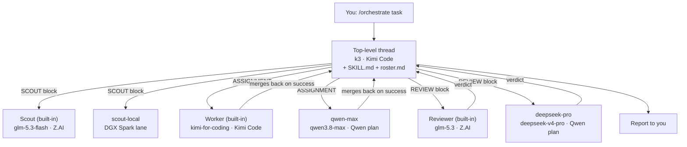

# Delta multi-model orchestration (v4)

v4 is v2's pinned-profile design (v3's override-only design works against
Delta's spawn tool, which says to omit the model unless the user asks for
one), plus:

- Provider ids in Delta's real form, `custom:<sha256 of base URL>` (section 2).
- `qwen-max` effort `xhigh`; Delta rejects efforts a model does not list.
- One custom profile per model, pinned to its model and thinking level; the
  task block sets its role (worker, reviewer, or best-of-N candidate). The
  orchestrator passes no model unless you name one, and the install fits
  Delta's limit of 7 custom profiles (section 3).
- Three or four models per role across the plan lanes and the optional
  ChatGPT, Grok, and Copilot lanes.
- Workers and Reviewers never revert, discard, stash, or delete pre-existing
  uncommitted work unless told to. Their isolated copies merge back on
  success, so a revert there would land in your checkout.
- The orchestrator copies each block's RULES word for word.
- `deploy.env`: the configuration deployed on this machine.
- Context router and Ponytail rules for Personal AGENTS.md, generated by the
  installer (section 6), and task blocks that use them: router-first search,
  `rtk` for shell output, terse reports, and a simplicity check in reviews.
- `.agents/prepare` example also warms the context indexes per checkout.

Run one Delta thread as an orchestrator that hands work to subagents on
different providers, keeps each provider within its limits, has every change
reviewed by a different model family, and spends per-token money only when
you allow it.

## How it works

There is no orchestrator profile, because in Delta the orchestrator is not
a subagent. It is the top-level thread you are typing into.

Three pieces cooperate:

| Piece | What it is | Where it lives |
|---|---|---|
| **The thread** | The orchestrator. Its agent owns your conversation and Delta's subagent tool. | A normal Delta thread, model chosen before the first message |
| **The skill** | The orchestrator's job description: procedure, invariants, task blocks, budgets | `~/.agents/skills/orchestrate/` |
| **The profiles** | The roles it can delegate to, each pinned to a model | Built-in Scout/Worker/Reviewer, plus `<delta config>/profiles/*.toml` |

What happens when you type `/orchestrate <task>`:

1. Delta attaches `SKILL.md` to your message. The skill is marked
   `disable-model-invocation: true`, so it only ever loads when you invoke it.
2. The thread's own agent (for example `k3`) reads it, then reads
   `references/roster.md`: the models, lanes, budgets, and reviewer order the
   installer generated for your accounts.
3. It plans, then calls Delta's subagent tool once per unit of work, naming a
   profile (`Worker`, `qwen-max`, `Reviewer`, ...) and sending a filled-in
   task block that carries the rules.
4. Delta runs each subagent in its own conversation and worktree, on the
   profile's model, and returns its final report to the thread.
5. The thread reviews, integrates, and reports back to you.



Why not a profile: a profile defines a child that some parent delegates to.
Delta has no profile for top-level threads, and its docs do not describe
subagents starting subagents of their own. A skill is how you give the
top-level agent a role on demand.

Why the built-ins stay: Delta's Scout, Worker, and Reviewer carry Delta's own
tuning. You pin their models in Settings. The task rules they lack travel in
the task blocks the skill sends, so built-in and custom profiles follow the
same rules. Custom profiles exist only for what the built-ins cannot do:
more scout families, more model families on other lanes, and the local lane.
Each custom model gets one profile that works, reviews, or competes in
best-of-N as its task block says; the built-in Worker and Reviewer serve as
best-of-N candidates the same way.

## Contents

| Path | Installed to | Installed when |
|---|---|---|
| `profiles/scout-qwen.toml.tmpl` | `<delta config>/profiles/` | Always |
| `profiles/scout-deepseek.toml.tmpl` | same | Always |
| `profiles/model.toml.tmpl` | same, as `<name>.toml`, one per model | `qwen-max`, `deepseek-pro` always; `minimax` when `MINIMAX_PROVIDER` is set; `gpt-sol` and `gpt-astra` when `GPT_PROVIDER` is set; `grok` when `GROK_PROVIDER` is set |
| `profiles/scout-gemini.toml.tmpl` | same | `COPILOT_PROVIDER` set |
| `profiles/scout-local.toml.tmpl` | same | `LOCAL_PROVIDER` and `LOCAL_MODEL` set |
| `skills/orchestrate/SKILL.md` | `~/.agents/skills/orchestrate/` | Always |
| `skills/orchestrate/references/best-of-n.md` | same `references/` | Always |
| `skills/orchestrate/scripts/bon.sh` | same `scripts/` | Always; best-of-N snapshot, patch handoff, apply, cleanup |
| `tests/bon-test.sh` | — | Not installed; regression check for `bon.sh`: `sh tests/bon-test.sh` |
| `references/roster.md` | same `references/` | Generated by the installer |
| `rules/personal-AGENTS.md` | — | Source of the router section of the generated rules |
| `rules/personal-AGENTS.generated.md` | Settings > Rules > Personal AGENTS.md | Regenerated by the installer on every run; pasted by hand |
| `examples/agents-prepare.sh` | your project's `.agents/prepare` | By hand, per project |
| `deploy.env` | — | Sourced before `install.sh` to reproduce this machine's install |
| `install.sh` | — | — |

The Delta config directory is the folder containing `settings.json`:
`~/Library/Application Support/delta` on macOS.

## 1. Prerequisites

Each provider entry already works in Delta, with `interleaved_reasoning` on for
every model and the output limits configured. For the Z.AI Coding Plan, use
the OpenAI-compatible base URL `https://api.z.ai/api/coding/paas/v4` and confirm
Delta is on Z.AI's supported-tools list; the plan is limited to those tools.

## 2. Find your provider ids

Profiles reference models as `<provider-id>/<model-id>`. A custom provider's
id is `custom:` followed by the SHA-256 of its base URL exactly as stored in
`settings.json`. Print every custom provider's id with:

```bash
python3 - <<'EOF'
import hashlib, json, os
d = json.load(open(os.path.expanduser("~/Library/Application Support/delta/settings.json")))
for p in d["native"]["custom_providers"]:
    print(f'{p["name"]:24} custom:{hashlib.sha256(p["base_url"].encode()).hexdigest()}')
EOF
```

Changing a provider's base URL changes its id; rerun the installer with
`--force` afterwards.

## 3. Install

```bash
export KIMI_PROVIDER=<id> ZAI_PROVIDER=<id> QWEN_PROVIDER=<id>
export ZAI_TIER=pro QWEN_TIER=standard            # your real tiers
# Optional lanes:
export MINIMAX_PROVIDER=<id> MINIMAX_BILLING=plan  # or metered
export GPT_PROVIDER=<id>                           # ChatGPT subscription
export GROK_PROVIDER=<id>                          # Grok subscription
export COPILOT_PROVIDER=<id>                       # GitHub Copilot
export LOCAL_PROVIDER=<id> LOCAL_MODEL=<served model id> LOCAL_FAMILY=GLM

./install.sh --dry-run          # prints every file and the full roster
./install.sh --prune-legacy     # add --force when reinstalling
```

To reproduce this machine's install: `. ./deploy.env && ./install.sh --force`.

`--prune-legacy` renames superseded profiles to `*.toml.retired`: the v1
profiles (`scout-fast`, `scout-deep`, `worker-kimi`, `reviewer-glm`), which the
built-ins replace, and the earlier v4 role profiles (`worker-*`,
`reviewer-*`, `candidate*`), which the per-model profiles replace. Run
`./install.sh --help` for every tuning variable, including overrides if you
pin the built-ins to models other than the defaults below.

Delta's spawn tool offers at most 10 profiles: the three built-ins, then
custom profiles in alphabetical order, dropping the rest without a word.
The installer counts every other `.toml` already in the profiles folder,
installs at most the remaining of 7 custom slots in a fixed priority order
(`./install.sh --help`; `PROFILE_PRIORITY` puts named profiles first), names
what it skipped and what takes the slots, and writes only installed profiles
into the roster.

## 4. Delta settings

**Settings > Subagents**

| Setting | Value |
|---|---|
| Enable Sub-agents | Only When Asked |
| Max Agents Per Thread | 6 |
| Max Agents Overall | 12 (raise to 16–24 once a shared admission proxy enforces provider limits) |
| Allow model overrides | On (lets you name a model no profile pins; the skill passes none otherwise) |
| Scout model | `glm-5.3-flash` (Z.AI Coding Plan), effort high |
| Worker model | `kimi-for-coding` (Kimi Code), effort high |
| Reviewer model | `glm-5.3` (Z.AI Coding Plan), effort high |

Set these three in Settings > Subagents > Profiles (Delta saves them as
`worker.toml`, `scout.toml`, and `reviewer.toml` in the profiles folder).
Left at "Same as Parent" or "Provider Default", they resolve to the thread's
model, so a Kimi thread's Reviewer would be Kimi reviewing Kimi.
The built-in models must match the roster; if you choose others, pass the
`BUILTIN_*` variables to the installer so the roster stays truthful.

**LLM Providers**

- Model Preferences (LLM Providers > each provider): leave every row on
  `Global · …`. Provider-specific choices take precedence over profile models
  and would silently reroute them.
- Models Shown in Picker: hide metered duplicates (the DeepSeek API copy of
  `deepseek-v4-pro`, the Qwen-plan copy of `glm-5.3`) so nobody picks them by
  accident.

## 5. Per-checkout test isolation

Concurrent agents get separate checkouts on one machine, so their test suites
collide on ports, Erlang node names and epmd, and test database names. Copy
`examples/agents-prepare.sh` to your project's `.agents/prepare` (check
Delta's "Prepare your project" docs for the exact contract) and adapt it. It
claims a unique slot per checkout (atomically, reclaiming slots whose
checkout is gone) and writes `.delta-env` with `DELTA_SLOT`,
`MIX_TEST_PARTITION`, `PORT`, `ERL_EPMD_PORT`, and `sccache` settings. The
skill sources `.delta-env` before every VERIFY command when it exists.

Delta has no SessionStart hook, so the script also starts the context-index
maintainer (`~/.codex/hooks/ensure-context-indexes.py`) for the new checkout,
detached and fail-open. Set `DELTA_PREPARE_INDEXES=0` to skip it, for example
when many short-lived subagent copies are created at once.

The maintainer indexes Git repositories, `~/scripts`, and each
`~/projects/<name>` (state for non-Git folders lives in
`~/Library/Caches/context-indexes/`, never in the folder). It never starts a
full build it cannot finish: codegraph above 5,000 files and zg above 4,000
are skipped with a note. A first zg build runs detached for up to 30 minutes;
if it times out, the hook removes the partial index it created and stops
retrying until you build one by hand. Only one first zg build runs at a time
on the machine (a lock in `~/Library/Caches/context-indexes/`): a checkout
that would start a second one reports zg as unavailable, and its next zg
search after the running build ends starts its own. The maintainer's zg
runs use 2 embedding contexts (as fast as zg's default 8 here, at about a
third of the memory) unless `ZVEC_GREP_LLAMA_CONTEXT_PARALLELISM` is set.
Keep vendored clones or bulky folders
out of an index with a `.gitignore` entry in that root; every tool honors it.

Delta clones each checkout from your local repository under
`<repo>/.delta/`, so checkouts contain only committed files on the branch
chosen at thread start. Uncommitted work, and files kept out of git (an
excluded `AGENTS.md`, an untracked `.agents/prepare`), never reach them.
Those nested clones also show up when Semble searches the main checkout:
Semble reads only `.gitignore` and `.sembleignore`, not `.git/info/exclude`.
The index maintainer keeps them out whenever it runs on a root holding
`.delta/`: it adds `.delta/` to a local `.sembleignore` and hides that file in
`.git/info/exclude`. It never edits a committed `.sembleignore`; it notes one
that lacks `.delta/`. Before the maintainer has run in a repository, the same
by hand:

```sh
cd /abs/repo && printf '.delta/\n' >> .sembleignore && printf '/.sembleignore\n' >> .git/info/exclude
```

Semble never evicts its cache, so every checkout it searched leaves about
50 MB in `~/Library/Caches/semble` after Delta deletes the checkout. On the
same runs the maintainer also runs `semble clear orphans`, which removes
caches whose folder is gone and keeps caches of remote repositories. A folder
on an unmounted drive also looks gone; its cache is rebuilt on its next search.

## 6. Context rules (Personal AGENTS.md)

Delta has no MCP servers or hooks, so the context tools reach agents through
Delta's Personal rules, which apply to every thread and subagent. Each run of
the installer writes `rules/personal-AGENTS.generated.md`: the context router
from `rules/personal-AGENTS.md`, followed by Ponytail's always-on text from the
installed plugin (the newest version under
`~/.codex/plugins/cache/ponytail/ponytail/`, or `PONYTAIL_DIR`). Paste it into
Settings > Rules > Personal AGENTS.md, replacing any earlier
`DELTA_CONTEXT_ROUTER` and `PONYTAIL` blocks. Re-paste after updating Ponytail.

| Codex mechanism | Delta replacement |
|---|---|
| Context router in `~/.codex/AGENTS.md` | The router section of the rules |
| MCP tools (semble, codegraph, zvec, githits) | The same tools' CLIs, named per question class in the router |
| PreToolUse RTK rewrite hook | The RTK section of the rules, plus `rtk` in the task blocks. A transparent shim is not possible: Delta runs commands as `/bin/sh -c '<cmd> \| cat'`, which reads no startup files, and RTK does not rewrite pipelines |
| SessionStart index hook | The rules' index step: agents run the maintainer once per folder per thread (`.agents/prepare`, section 5, can also start it) |
| Caveman proxy, hooks, MCP | Caveman's skills in `~/.agents/skills` and its local `toon encode`, named in the rules; `caveman tools mem` only on request, since project memory goes to the llm-wiki, which only the top-level thread writes (subagents report `LEARNED:` items). Delta's model traffic stays uncompressed: the proxy compresses a streaming request only when it carries Caveman's MCP retrieve tool, which Delta cannot add. Result blocks ask for terse reports instead |
| Ponytail plugin hooks | Ponytail's `AGENTS.md` text in the rules, always at full level. Reviewers check simplicity against it |

The generated Ponytail section changes one sentence: "Grep every caller"
becomes "Find every caller (codegraph where the language is covered, otherwise
tgrep)", so it agrees with the router. If upstream rewords that sentence, the
installer keeps the text verbatim and warns.

The rules add about 7 KB to every thread's context. The router pays that back
when it replaces grep-and-read loops.

Smoke test (new thread, any model):

```
Using the context tool router in your rules: find where <some function> is
defined with tgrep, find code related to <some behavior> with semble, and
list the callers of <some Elixir function> with codegraph. Show each command.
```

Each command should be the routed CLI with an absolute root, and shell
commands such as `git status` should carry the `rtk` prefix.

## 7. Smoke test

Commit or stash in-progress work first if you can: isolated copies carry
every uncommitted change, and reviewers diff against `HEAD`.

New thread, select `k3` with effort high before sending anything, then:

```
/orchestrate Recon only. Spawn the built-in Scout and qwen-max in parallel.
Each reports the model it is running as and this repository's top-level
layout; qwen-max makes no changes. Then spawn deepseek-pro to report
its model with no review. Stop after reporting; do not plan or dispatch work.
```

Confirm each spawn line in the thread (`Agent spawned: … (profile · model)`)
names the expected model; that label is Delta's, not the subagent's self-report.

## 8. Use

```
/orchestrate <task, constraints, and how you will judge it done>
```

Ask for best-of-N explicitly ("best-of-3 across Kimi, GLM, and Qwen") or let
the skill choose it for a high-risk unit. If another orchestrator thread is
running, say so; the skill halves its budgets.

## Limits and next steps

- Budgets are enforced per orchestrator thread by instruction, not by Delta.
  A shared admission proxy (per-provider concurrency, window budgets,
  429-aware queueing) is what makes higher Max Agents Overall safe.
- Delta records tracked files and untracked files that Git does not ignore;
  ignored build output does not merge back from isolated workers. Untracked,
  non-ignored artifacts do, which is why every block requires a clean
  `git status`.
- Nested delegation remains untested. If a future Delta lets subagents spawn
  subagents, an orchestrator profile becomes possible; this design works
  either way.
